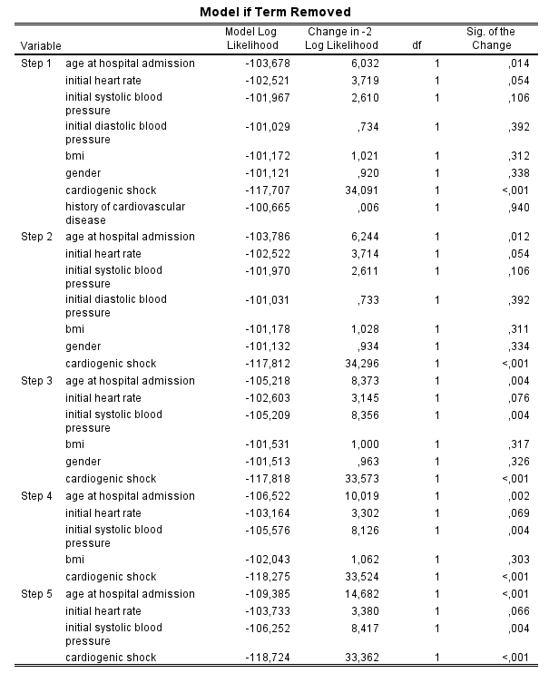

## Part 1: Estimated marginal means in a two-way ANOVA

### Load the data

```{r}  
library(haven)   # for reading SPSS files
library(dplyr)   # for data manipulation
library(ggplot2) # for data visualization
library(emmeans) # for estimated marginal means
library(car)    # for calculating type-III ANOVA tables
library(MASS)   # for automated selection

# Load the dataset
whas500 <- read_sav("datasets/whas500.sav")

# Convert labeled variables to factors
whas500 <- whas500 %>%
  mutate(across(where(is.labelled), as_factor))
```

### Exploratory plot

```{r}
#| echo: true

whas500 |>
  group_by(gender, chf) |>
  summarise(
    mean_los = mean(los, na.rm = TRUE),
    .groups = "drop"
  ) |>
  ggplot(aes(x = chf, y = mean_los, group = gender, color = gender)) +
  geom_point(size = 3) +
  geom_line() +
  labs(
    x = "Congestive heart complications",
    y = "Mean length of stay (days)",
    color = "Gender"
  )
```

**Question:** Based on the interaction plot, do the lines look approximately parallel, or is there visual evidence that the association between CHF and length of stay differs by gender?

**Answer:**  
The lines look approximately parallel. Patients with CHF have a longer mean length of stay for both males and females, and the size of this difference appears similar across gender. There is no strong visual evidence of an interaction.

### Two-way ANOVA model

```{r}
#| echo: true

fit_emm <- lm(los ~ gender * chf, data = whas500)
anova(fit_emm)
```

**Question:** Inspect the ANOVA table. Is there evidence of an interaction between `gender` and `chf`?

**Answer:**  
No. The interaction between `gender` and `chf` is not statistically significant, $F(1, 496) = 0.03$, $p = 0.872$. We therefore do not focus on formal simple-effect contrasts. Instead, we interpret the main effects and their estimated marginal means.

### Estimated marginal means and contrasts

```{r}
#| echo: true

emmeans(fit_emm, ~ gender)
emmeans(fit_emm, ~ chf)
emmeans(fit_emm, ~ gender * chf)

# Contrast tests for the main effects
pairs(emmeans(fit_emm, ~ gender))
pairs(emmeans(fit_emm, ~ chf))

# Contrast tests for simple effects
# Only focus on these if the interaction is meaningful/statistically significant.
pairs(emmeans(fit_emm, ~ chf | gender))
pairs(emmeans(fit_emm, ~ gender | chf))
```

**Question:** What is the estimated mean length of stay for males and females, averaged over CHF status?

**Answer:**  
Averaged over CHF status, the estimated marginal mean length of stay is approximately **6.13 days** for males and **6.89 days** for females. The main-effect contrast is not statistically significant at the 0.05 level ($p = 0.095$).

**Question:** What is the estimated mean length of stay for patients with and without CHF, averaged over gender?

**Answer:**  
Averaged over gender, the estimated marginal mean length of stay is approximately **5.70 days** for patients without CHF and **7.32 days** for patients with CHF. The main-effect contrast is statistically significant ($p < 0.001$), indicating that patients with CHF have a longer estimated mean length of stay.

**Question:** Should we focus on main-effect contrasts or simple-effect contrasts?

**Answer:**  
Because the interaction is not statistically significant, we focus on the **main-effect contrasts**. The simple-effect contrasts are shown to demonstrate how they can be requested, but they are not the primary basis for interpretation in this example.

## Part 2: Building prediction models using backward elimination

### Step 1: Fit the initial linear regression model

Create an initial model for hospital length of stay (`los`) using the following predictors: `age`, `gender`, `hr`, `sysbp`, `diasbp`, `bmi`, `cvd`, `sho`. Run/summarize the model to inspect coefficients and p-values.

```{r}
initial_model <- lm(los ~ age + gender + hr + sysbp + diasbp + bmi + cvd + sho, data = whas500)
summary(initial_model)
```

### Step 2: Eliminate the least significant predictor

```{r}
# Obtain the Type III ANOVA table
Anova(initial_model, type = "III")
```

The ANOVA table shows that the predictor with the highest p-value is `sysbp` ($p = 0.92$). Systolic blood pressure is the least significant predictor and should be removed from the model.

### Step 3: Repeat the steps

The following variables are sequentially removed from the model (after initially removing `sysbp`):

1. `age`: p-value = 0.86
2. `cvd`: p-value = 0.41
3. `bmi`: p-value = 0.44
4. `diasbp`: p-value = 0.22

### Step 4: Final model

```{r}
#| echo: true
final_model <- lm(los ~ gender + hr + sho, data = whas500)
summary(final_model)

# 95% CIs for regression coefficients
confint(final_model)
```

The final model for hospital length of stay includes `gender`, `hr`, and `sho`. All predictors have $p < 0.10$. 

| Predictor | Coefficient | 95% CI | p-value |
| :--- | :--- | :--- | :--- |
| (Intercept) | 3.80 | [2.23, 5.37] | < 0.001 |
| Gender (Female) | 0.91 | [0.08, 1.75] | 0.033 |
| Heart rate | 0.02 | [0.003, 0.038] | 0.020 |
| Cardiogenic shock | 3.55 | [1.57, 5.53] | < 0.001 |

#### Residual plots

```{r}
# Histogram of residuals
hist(residuals(final_model), main = "Histogram of Residuals", xlab = "Residuals", 20)

# Scatterplot of fitted values vs. residuals
plot(final_model, which = 1)
```
  
The overall fit of the model appears reasonable, as the residuals are generally centered around zero with no major patterns suggesting severe violations of linearity. However, there are some outliers with very long lengths of stay (LOS) that are not adequately captured by the model. These outliers lead to a right skew in the residual distribution, as seen in the histogram, influencing model fit. While the current model seems to work reasonably well for most observations, further steps (e.g., transformations or robust regression techniques) could be considered to better account for these extreme cases.  

## Part 3: Automated procedures for building prediction models (logistic regression)

In this part, we explore automated procedures for predictor selection in **logistic regression** prediction models, focusing on predicting in-hospital death (`dstat`).

#### R

```{r}
#| echo: true

# Create a 0/1 outcome (1 = dead)
whas500 <- whas500 |>
  mutate(dstat01 = ifelse(dstat == "dead", 1, 0))

fit_full <- glm(
  dstat01 ~ age + gender + hr + sysbp + diasbp + bmi + cvd + sho,
  family = binomial,
  data = whas500
)

fit_step <- stepAIC(fit_full, direction = "backward", trace = FALSE)
summary(fit_step)

# Odds ratios and 95% CIs
exp(cbind(OR = coef(fit_step), confint.default(fit_step)))
```

**Question:** Which predictors are retained in the prediction model?

**Answer:**  
The final logistic regression model obtained via backward elimination using AIC includes the following predictors: **age**, **hr** (heart rate), **sysbp** (systolic blood pressure), and **sho** (cardiogenic shock).

#### SPSS

In SPSS, using the **Backward: LR** method (standard settings), the procedure also yields a final model with these four predictors.



## Part 4: Causal diagrams

For each of the exercises below:

- First solve the diagram by hand using the recipe from the lab.
- Pay special attention to the meaning of a path: a path connects variables, but does not have to follow the direction of the arrows.
- Then check your answer using the [DAGitty webtool](http://www.dagitty.net/dags.html).

### Exercise 1

In the graph depicted below, for which variables do you need to adjust to assess the unconfounded effect of E on O (there may be several possibilities)?


**Answer:**  
Using the recipe, there are several non-causal paths between E and O that need to be considered. Adjusting for v2 blocks one path, but it also opens a path through a collider structure (E - v1 - v3 - O). This newly opened path needs to be closed by also conditioning on v1 or v3, or both. 
Hence, there are 3 options: (v1, v2, v3) ; (v1, v2) ; and finally, (v2, v3).

### Exercise 2

In the graph depicted below, what happens when you additionally adjust for **v5**?


**Answer:**
When adjusting for v5, we are blocking the effect through this indirect path from E to O (v5 is a mediator between E and O). Instead of the total effect of E on O, we will be estimating the direct effect. 

In DAGitty, when you set v5 to ‘adjusted’, the algorithm will say the following:  “The total effect cannot be estimated due to adjustment for an intermediate or a descendant of an intermediate.”

### Exercise 3

This diagram is slightly different: **v1** now is the exposure. For which variables do you need to adjust to assess the unconfounded effect of **v1** on **O**?


**Answer:**
No adjustment is needed: there are no backdoor paths (removing all arrows leaving v1 reveals no remaining unblocked path from v1 to O).

### Exercise 4

Now, **v2** is the exposure. For which variables do you need to adjust to assess the total unconfounded effect of **v2** on **O**?


**Answer:**
Using the recipe, there are three non-causal paths that need to be blocked when v2 is the exposure:

a) v2 - v3 - O and 
b) v2 - v1 - E - O 
c) v2 - v1 - E - v5 - O

Backdoor path a) can be closed by conditioning on v3. 

Backdoor path b) can be closed by conditioning on v1 (but not by conditioning on E, as you would no longer be estimating the total effect by blocking the paths from v2 to O mediated by E).

In this case, you should therefore condition on v1 and v3.

### Exercise 5

Back to the first DAG. However, **v2** is now unmeasured. Can we still obtain an unconfounded estimate of the effect of **E** on **O**?


**Answer:**
No, we cannot close the backdoor path between E and O since v2 is unmeasured and cannot be corrected for.

### Exercise 6

See the DAG below: you adjusted for **v5**. What would be the consequence of this action?


**Answer:**
There is no consequence: conditioning on v5 cannot alter any of the estimated effects in the DAG (it is neither a confounder, collider, nor a mediator in the E-O relationship).
